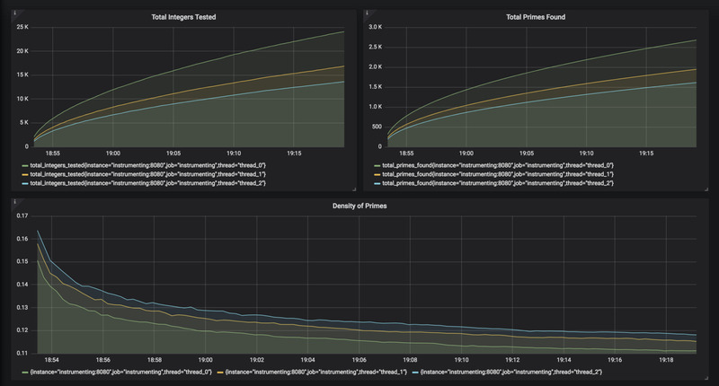

# Prime Number Monitior
This project is a simple example of example of how to hook up [Grafana](https://grafana.com/) and [Prometheus](https://prometheus.io/) with [Docker](https://www.docker.com/) for monitoring and dashboarding containers. The core code is a server that spins up three threads, each of which iteratively tests integers for primality with trial division. Each thread is instrumented with Prometheus, and a dashboard is provided with Grafana that displays the resulting metrics and some derivatives.

The server is written in [Go](https://golang.org/), and a build script cross-compiles it to a Linux AMD64 binary, which is in turn bundled into an [Alpine Linux](https://alpinelinux.org/) Docker container. The containers are deployed to a Docker bridge network, which handles DNS resolution very nicely.



## Building and Deploying
To build and deploy the server and monitoring images, you'll need the following tools installed locally:

 * `docker >= 17.0`
 * `go >= 1.5`

You'll need to connect docker to a Linux host with AMD64 architecture, as the build scripts compile for that. If you don't have such a host available, you can either fiddle with the build scripts to change this requirement or use `docker-machine` and `virtualbox` to run a virtual host.

If you'd like to build the server on its own, see [Building](#building). Otherwise, to build and deploy it in a single step along with Grafana and Prometheus, see [Deploying](#deploying).

### Building
The server can be built on its own as a local executable by running the following commands from the root directory of the repo:

```bash
  source vars.sh && go install guypj/instrumenting
```

This will generate an executable at `bin/instrumenting`. To cross-compile a Linux AMD64 executable and bake it into a docker image, run the provided build script:

```bash
  ./build/instrumenting/build.sh
```

The image will then be deployable as `guypj/instrumenting:latest`, or you can fetch the image ID directly:

```bash
  docker image ls | grep guypj/instrumenting
```

### Deploying
Grafana, Prometheus and the server can all be built and deployed individually by running their respective deploy scripts. You'll have to create a docker bridge network for them first, however:

```bash
  docker network create "guypj/instrumenting"
  ./build/grafana/deploy.sh
  ./build/prometheus/deploy.sh
  ./build/instrumenting/deploy.sh
```

To have each of them built and deployed for you, run the global deploy script:

```bash
  ./build/deploy.sh
```

Once everything has been deployed, you can visit `[DOCKER_HOST_IP]:3000` to land on the Grafana home page, where the `Prime Numbers` dashboard has been set up for you to monitor the server.

## License
This project is licensed under the MIT License - see the [LICENSE.md](LICENSE.md) file for details
